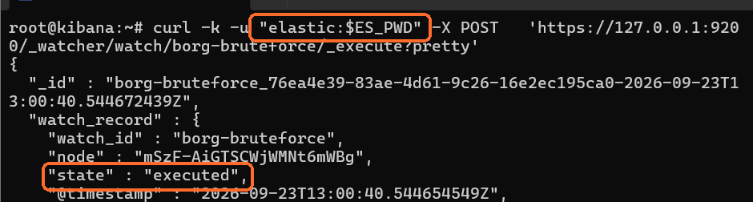
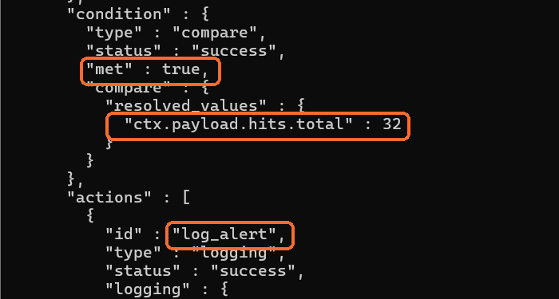
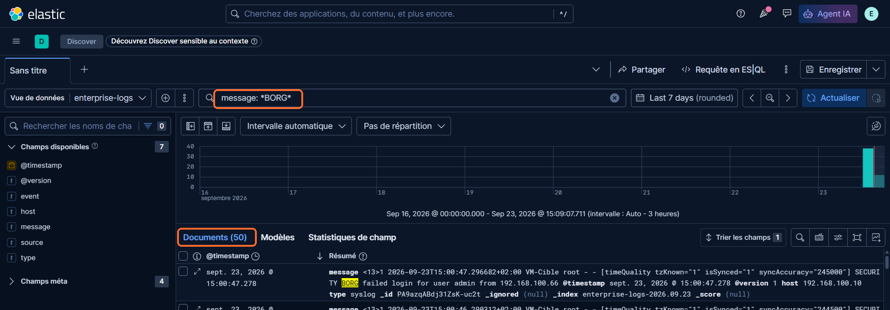
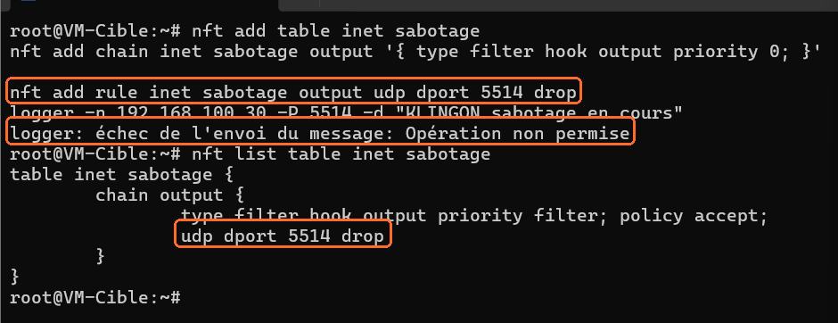
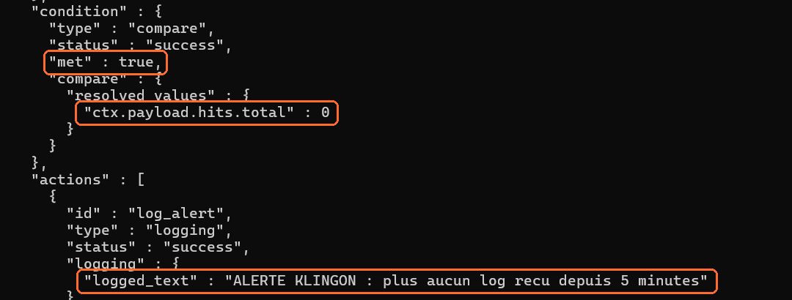

# Mission 08 — Réponse à incident

Deux playbooks de réponse à incident, construits sur l'infrastructure montée en missions 05 à 07 (ELK, Watcher, TShark).

Chaque incident a été **déclenché réellement** sur le laboratoire, puis détecté par la chaîne de supervision. Les captures montrent la détection telle qu'elle s'est produite.

Les procédures suivent les trois temps demandés : **contenir, éradiquer, récupérer**.

---

## Rappel du laboratoire

| Machine | IP | Rôle |
|---|---|---|
| VM-Cible | 192.168.100.10 | génère les logs |
| VM-ELK | 192.168.100.30 | Elasticsearch, Logstash, Kibana, Watcher |

Les logs partent de VM-Cible en UDP sur le port 5514, passent par Logstash et sont indexés dans `enterprise-logs-*`.

---

# Playbook A — Intrusion Borg (tentatives de connexion répétées)

## 1. Le scénario

Une série de connexions échouées sur le compte `admin`, toutes depuis la même adresse. C'est le comportement typique d'une attaque par force brute : l'attaquant essaie des mots de passe à la chaîne.

Simulation de l'attaque depuis VM-Cible :

```bash
for i in $(seq 1 10); do
  logger -n 192.168.100.30 -P 5514 -d "SECURITY BORG failed login for user admin from 192.168.100.66"
  sleep 1
done
```

## 2. Détection

Un watch `borg-bruteforce` a été créé dans Elasticsearch :

| Paramètre | Valeur |
|---|---|
| Fréquence | toutes les minutes |
| Index | `enterprise-logs-*` |
| Recherche | `failed` dans le champ `message` |
| Fenêtre | 5 minutes |
| Condition | plus de 5 occurrences |
| Action | écrit une alerte dans le journal |

**Pourquoi un seuil à 5 ?** Une connexion échouée isolée, c'est une faute de frappe. Cinq en cinq minutes, non. Le seuil sert à séparer l'erreur humaine de l'attaque. Trop bas, on crée des fausses alertes ; trop haut, on laisse passer l'attaque.

Création du watch :

```bash
read -s -p "Mot de passe elastic : " ES_PWD; echo
curl -k -u "elastic:$ES_PWD" \
-X PUT 'https://127.0.0.1:9200/_watcher/watch/borg-bruteforce' \
-H 'Content-Type: application/json' \
-d '{
  "trigger": {"schedule": {"interval": "1m"}},
  "input": {
    "search": {
      "request": {
        "indices": ["enterprise-logs-*"],
        "body": {
          "query": {
            "bool": {
              "must": [{"match": {"message": "failed"}}],
              "filter": [{"range": {"@timestamp": {"gte": "now-5m", "lte": "now"}}}]
            }
          }
        }
      }
    }
  },
  "condition": {"compare": {"ctx.payload.hits.total": {"gt": 5}}},
  "actions": {
    "log_alert": {
      "logging": {"text": "ALERTE BORG : tentatives de connexion repetees detectees"}
    }
  }
}'
```

Le mot de passe n'est pas écrit dans la commande : `read -s` le demande au clavier sans l'afficher, et `curl` le récupère dans la variable. Cela évite de le retrouver dans les captures d'écran et dans l'historique du dépôt.



## 3. Résultat de la détection

Le watch s'exécute, la condition est remplie et l'action part.



- `"met" : true` — la condition est remplie
- `"ctx.payload.hits.total" : 32` — 32 événements `failed` dans la fenêtre de 5 minutes
- `"id" : "log_alert"` en `"status" : "success"` — l'alerte a bien été écrite

Les 32 événements sont ceux de la **fenêtre de 5 minutes** du watch. Dans Discover, sur 7 jours, on en compte 50 : ce sont tous les événements envoyés depuis le début des tests.



L'écart entre 50 et 32 n'est pas une erreur, c'est la différence de fenêtre. Le watch ne compte pas une attaque : il compte ce qui s'est produit sur les 5 dernières minutes. C'est ce qui lui permet de détecter un pic plutôt qu'un total.

## 4. Qualifier avant d'agir

Avant de bloquer quoi que ce soit, quatre questions. Bloquer une adresse légitime, c'est créer une panne en croyant régler un incident.

| Question | Comment y répondre |
|---|---|
| Combien d'adresses sources ? | une seule → attaque ciblée ; plusieurs → attaque distribuée |
| Le compte visé existe-t-il vraiment ? | si non, l'attaque est vouée à l'échec |
| L'adresse source est-elle connue ? | un poste interne mal configuré donne le même signal |
| **Une connexion a-t-elle réussi après les échecs ?** | c'est la question qui change tout |

Cette dernière est la plus importante. Une série d'échecs suivie d'un succès signifie que l'attaquant a trouvé le mot de passe. On ne traite plus une tentative, on traite une intrusion.

Dans Kibana Discover :

```kql
message: *failed*
message: *Accepted*
```

## 5. Contenir

| Action | Raison |
|---|---|
| Bloquer l'adresse source au pare-feu | arrête l'attaque en cours |
| Suspendre le compte visé | empêche l'accès même si le mot de passe est trouvé |
| Vérifier si le compte a des droits d'administration | détermine la gravité |

**Ne pas éteindre la machine.** C'est le réflexe naturel et c'est une erreur : on perd la mémoire vive et les connexions en cours, donc une partie des traces.

## 6. Éradiquer

Deux cas, selon la qualification.

**Aucune connexion réussie** — il n'y a rien à éradiquer, l'attaque a échoué. On garde les traces et on renforce : mot de passe plus long, limitation du nombre d'essais.

**Une connexion a réussi** — l'attaquant est entré. Il faut :
- changer le mot de passe du compte et de tous ceux qui partagent le même ;
- chercher ce qu'il a laissé derrière lui : tâches planifiées, clés SSH ajoutées, nouveaux comptes ;
- en cas de doute sur l'étendue, réinstaller la machine à partir d'une sauvegarde saine.

## 7. Récupérer

1. Réactiver le compte avec un nouveau mot de passe.
2. Lever le blocage de l'adresse une fois l'incident clos.
3. Vérifier que les logs remontent toujours dans `enterprise-logs-*` — une chaîne de supervision cassée pendant l'incident, c'est un second incident.
4. Ajuster le seuil du watch si l'incident a montré qu'il était mal réglé.

## 8. Traces à conserver

- l'export Discover des événements de la période ;
- la sortie du watch (elle horodate la détection) ;
- une capture réseau TShark si l'attaque est encore en cours.

## 9. Limite de ce playbook

L'action du watch se contente d'écrire dans un journal. **Personne n'est prévenu en temps réel** : il faut que quelqu'un aille lire. Dans un environnement réel, l'action enverrait un mail ou appellerait un webhook vers un outil de ticketing.

C'est la limite assumée de ce laboratoire — la détection fonctionne, la notification reste à construire.

---

# Playbook B — Sabotage Klingon (arrêt de la remontée de logs)

## 1. Le scénario

Un attaquant déjà présent sur la machine coupe l'envoi des logs vers le serveur de supervision. Objectif : continuer à agir sans laisser de trace. Ce n'est pas un incident bruyant comme le bruteforce — au contraire, il cherche le silence.

Simulation depuis VM-Cible, en bloquant la sortie UDP 5514 :

```bash
nft add table inet sabotage
nft add chain inet sabotage output '{ type filter hook output priority 0; }'
nft add rule inet sabotage output udp dport 5514 drop
logger -n 192.168.100.30 -P 5514 -d "KLINGON sabotage en cours"
```



Le `logger` échoue avec `Opération non permise` : le message ne sort pas de la machine. C'est la preuve que le sabotage fonctionne. À partir de cet instant, tout ce qui se passe sur VM-Cible est invisible depuis Kibana.

## 2. Détection

Ici on ne peut pas détecter un pic : il n'y a plus rien à compter. Il faut détecter **l'absence**.

Un watch `klingon-sabotage` a été créé :

| Paramètre | Valeur |
|---|---|
| Fréquence | toutes les minutes |
| Index | `enterprise-logs-*` |
| Recherche | tous les événements, sans filtre de contenu |
| Fenêtre | 5 minutes |
| Condition | 0 événement (`lte: 0`) |
| Action | écrit une alerte dans le journal |

La seule différence avec le playbook A tient dans la condition : `gt: 5` devient `lte: 0`. On ne cherche plus un excès, on cherche un vide.

```bash
read -s -p "Mot de passe elastic : " ES_PWD; echo
curl -k -u "elastic:$ES_PWD" \
-X PUT 'https://127.0.0.1:9200/_watcher/watch/klingon-sabotage' \
-H 'Content-Type: application/json' \
-d '{
  "trigger": {"schedule": {"interval": "1m"}},
  "input": {
    "search": {
      "request": {
        "indices": ["enterprise-logs-*"],
        "body": {
          "query": {
            "bool": {
              "filter": [{"range": {"@timestamp": {"gte": "now-5m", "lte": "now"}}}]
            }
          }
        }
      }
    }
  },
  "condition": {"compare": {"ctx.payload.hits.total": {"lte": 0}}},
  "actions": {
    "log_alert": {
      "logging": {"text": "ALERTE KLINGON : plus aucun log recu depuis 5 minutes"}
    }
  }
}'
```

## 3. Résultat de la détection

Cinq minutes après le blocage, la fenêtre est vide et le watch se déclenche.



- `"met" : true` — la condition est remplie
- `"ctx.payload.hits.total" : 0` — aucun événement sur les 5 dernières minutes
- l'alerte `ALERTE KLINGON : plus aucun log recu depuis 5 minutes` est écrite

Il faut attendre que la fenêtre se vide complètement. Tant qu'un seul log de moins de 5 minutes subsiste, le compteur n'est pas à zéro et l'alerte ne part pas. C'est aussi le délai de détection : ce type d'alerte ne peut pas être instantané.

## 4. Qualifier avant d'agir

Le silence n'est pas forcément une attaque. C'est la principale difficulté de ce playbook : la même alerte se déclenche pour une panne banale.

| Cause possible | Comment la reconnaître |
|---|---|
| La machine est éteinte ou a redémarré | elle ne répond pas au ping |
| Le service d'envoi des logs est arrêté | la machine répond, mais `systemctl` montre le service inactif |
| Panne réseau entre les deux machines | les autres flux sont coupés aussi |
| Disque plein côté Elasticsearch | plus aucune machine ne remonte de logs, pas seulement celle-ci |
| **Sabotage** | la machine fonctionne, le réseau fonctionne, mais une règle de pare-feu bloque le port |

Le test qui tranche : **est-ce que les autres machines remontent encore des logs ?** Si oui, le problème est local à cette machine. Si non, il est côté serveur.

Pour vérifier la présence d'une règle de blocage sur la machine suspecte :

```bash
nft list ruleset
```

## 5. Contenir

| Action | Raison |
|---|---|
| Isoler la machine du reste du réseau | si c'est un sabotage, l'attaquant y a les droits root |
| Renforcer la surveillance des autres machines | le sabotage précède souvent une action plus large |
| Récupérer les logs locaux de la machine | ils n'ont pas été envoyés, mais ils existent peut-être encore sur place |

Ce dernier point est important : les logs bloqués en sortie sont souvent toujours présents dans `/var/log` sur la machine. C'est la seule façon de reconstituer ce qui s'est passé pendant l'aveuglement.

## 6. Éradiquer

Supprimer la règle ne suffit pas. **Poser une règle de pare-feu demande les droits root** : il y a donc une compromission antérieure, et c'est elle le vrai incident.

1. Supprimer la règle de blocage.
2. Chercher comment l'attaquant a obtenu les droits : historique des commandes, comptes créés, tâches planifiées, clés SSH.
3. Remonter à l'intrusion d'origine — le sabotage n'est qu'une conséquence.
4. Si l'origine reste introuvable, réinstaller la machine.

## 7. Récupérer

```bash
nft delete table inet sabotage
```

Puis :

1. Vérifier que les logs remontent à nouveau, avec un `logger` de test suivi d'une recherche dans Discover.
2. Mesurer la durée de l'aveuglement : l'horodatage du dernier log reçu en marque le début.
3. Récupérer les logs locaux de la période si la machine les a conservés.
4. Accepter que la période soit peut-être définitivement perdue, et le noter dans le rapport d'incident.

## 8. Traces à conserver

- la règle de pare-feu trouvée (`nft list ruleset`) ;
- l'horodatage du dernier log reçu, qui date le début du sabotage ;
- la sortie du watch, qui date la détection ;
- les logs locaux de la machine sur la période aveugle.

L'écart entre le dernier log reçu et le déclenchement de l'alerte donne le délai de détection. C'est un chiffre à connaître : il mesure la qualité de la supervision.

## 9. Limites de ce playbook

**Le watch ne distingue pas un sabotage d'une panne.** Il signale un silence, la qualification reste humaine. Un watch par machine permettrait au moins de savoir laquelle s'est tue.

**Si l'attaquant s'en prend à VM-ELK elle-même, plus rien ne détecte quoi que ce soit.** Le superviseur n'est pas supervisé. Dans une vraie infrastructure, c'est un serveur tiers qui vérifie que la chaîne de supervision est en vie.

---

# Ce que les deux playbooks ont en commun

| | Playbook A — Borg | Playbook B — Klingon |
|---|---|---|
| Signal | trop d'événements | plus aucun événement |
| Condition | `gt: 5` | `lte: 0` |
| Détection | quasi immédiate | 5 minutes minimum |
| Risque d'erreur | bloquer une adresse légitime | confondre panne et attaque |

Les deux reposent sur la même chaîne : Logstash collecte, Elasticsearch indexe, le Watcher compare à un seuil. Seule la condition change.

La supervision ne dit jamais « il y a une attaque ». Elle dit « ce que j'observe sort de l'ordinaire ». La qualification, puis la décision de contenir, restent humaines — et c'est pour cela que ces procédures s'écrivent à l'avance, à froid, plutôt que pendant l'incident.
