# SecuEnterprise-ELK

Documentation du projet **SecuEnterprise**, incluant les missions 5, 6, 7 et 8 réalisées sur VM-ELK.

> **Mission 08 :** [Playbooks de réponse à incident](MISSION-08-PLAYBOOKS.md) — intrusion Borg et sabotage Klingon.
>
> **Bonus réseau/DNS :** [Documentation sur `kibana.local` et la communication entre les machines](BONUS-DNS-RESEAU.md).

---

## Architecture du laboratoire

| Machine | IP Host-Only | Rôle |
|---|---|---|
| VM-Cible | 192.168.100.10 | Génération des logs |
| VM-ELK | 192.168.100.30 | Elasticsearch, Logstash, Kibana, TShark |

Réseau Host-Only : `192.168.100.0/24`. Une interface NAT a également été utilisée ponctuellement pour l'accès Internet. Les captures réalisées sur cette interface affichent donc les adresses du réseau NAT et non celles du réseau Host-Only.

---

# Mission 5 — Installation et configuration de l'ELK Stack

## 1. Les composants

- **Elasticsearch** : stockage et recherche des logs
- **Logstash** : réception et traitement des logs
- **Kibana** : visualisation et analyse
- **Watcher** : détection de conditions et déclenchement d'alertes

Elasticsearch fonctionne sur `https://127.0.0.1:9200`.
Kibana est accessible sur `http://192.168.100.30:5601`.

## 2. Installation

Installation d'Elasticsearch puis de Kibana sur VM-ELK, avec génération du token d'enrôlement pour relier Kibana au cluster.

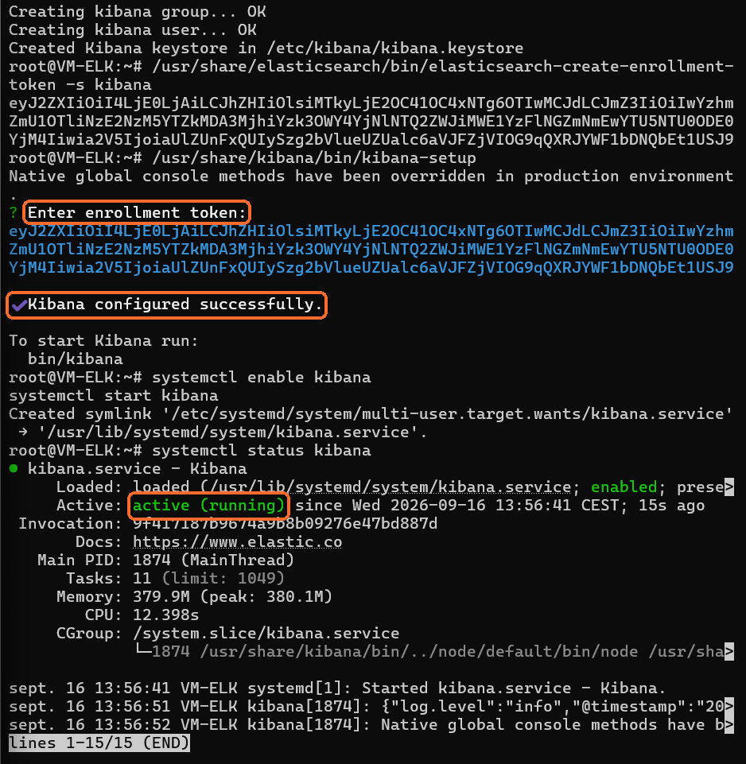

## 3. Logstash

Fichier : `/etc/logstash/conf.d/enterprise.conf`

```conf
input {
  tcp {
    port => 5044
    codec => json
  }

  udp {
    port => 5514
    type => "syslog"
    ecs_compatibility => "disabled"
  }
}

output {
  elasticsearch {
    hosts => ["https://127.0.0.1:9200"]
    index => "enterprise-logs-%{+YYYY.MM.dd}"
    user => "elastic"
    password => "TON_MDP"
    ssl_certificate_authorities => ["/etc/logstash/certs/http_ca.crt"]
  }

  stdout {
    codec => rubydebug
  }
}
```

Le mot de passe réel n'est pas stocké dans GitHub : `TON_MDP` est un placeholder.

Test de configuration :

```bash
su -s /bin/bash logstash -c '/usr/share/logstash/bin/logstash --path.settings /etc/logstash -t'
```

Résultat : `Configuration OK`.

Puis :

```bash
systemctl restart logstash
systemctl status logstash --no-pager
```

Résultat : service `active (running)`.

Au démarrage, Logstash se connecte à Elasticsearch, crée le template d'index `enterprise-logs-%{+YYYY.MM.dd}` et ouvre ses écouteurs.

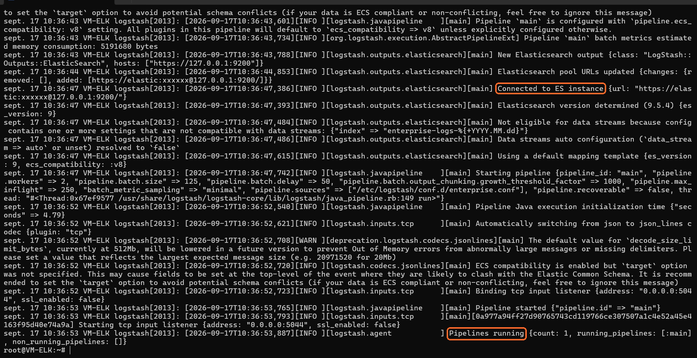

## 4. Import des logs

La VM-Cible envoie ses logs vers Logstash en UDP sur le port `5514`.

Test :

```bash
logger -n 192.168.100.30 -P 5514 -d "TEST LOG FINAL VM-CIBLE"
```

Les logs sont ensuite stockés dans les index `enterprise-logs-YYYY.MM.dd`.

La réception réseau a été vérifiée avec :

```bash
tcpdump -ni ens34 udp port 5514
```

La capture ci-dessous montre les deux côtés : à gauche le `tcpdump` sur VM-ELK, à droite l'envoi du log depuis VM-Cible.

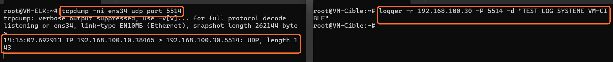

Chaîne validée :

```text
VM-Cible (192.168.100.10)
        |
        | UDP 5514
        v
Logstash (192.168.100.30)
        |
        v
Elasticsearch
```

## 5. Kibana

Une Data View `enterprise-logs-*` a été créée.

Visualisations réalisées :

- graphique en barres des sources ;
- graphique temporel avec `@timestamp` ;
- graphique circulaire des événements ;
- tableau avec `event`, `source`, `message` et `@timestamp`.

Les visualisations sont regroupées dans un dashboard Kibana.

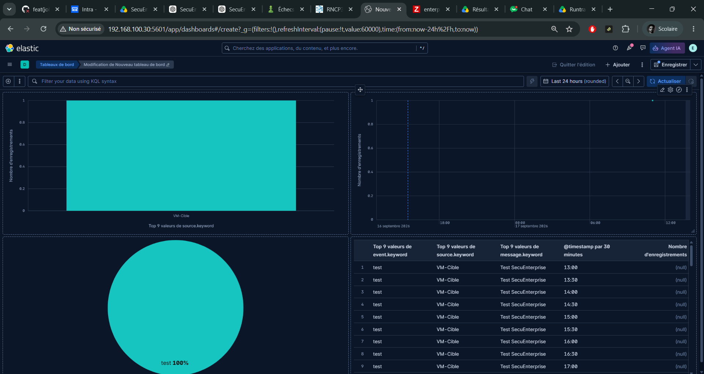

## 6. Watcher

Watch configuré : `enterprise-test-alert`.

Paramètres :

- déclenchement toutes les **1 minute** ;
- recherche dans `enterprise-logs-*` ;
- recherche des messages contenant `TEST` ;
- fenêtre temporelle : **5 minutes** ;
- condition : `hits.total > 0` ;
- action : journalisation d'une alerte.

Création :

```bash
curl -k -u 'elastic:TON_MDP' \
-X PUT 'https://127.0.0.1:9200/_watcher/watch/enterprise-test-alert' \
-H 'Content-Type: application/json' \
-d '{
  "trigger": {"schedule": {"interval": "1m"}},
  "input": {
    "search": {
      "request": {
        "indices": ["enterprise-logs-*"],
        "body": {
          "query": {
            "bool": {
              "must": [{"match": {"message": "TEST"}}],
              "filter": [{"range": {"@timestamp": {"gte": "now-5m", "lte": "now"}}}]
            }
          }
        }
      }
    }
  },
  "condition": {"compare": {"ctx.payload.hits.total": {"gt": 0}}},
  "actions": {
    "log_alert": {
      "logging": {"text": "ALERTE SECURITE : log TEST détecté sur VM-Cible"}
    }
  }
}'
```

Un log de test est envoyé depuis la VM-Cible pour déclencher le watch :

```bash
logger -n 192.168.100.30 -P 5514 -d "TEST WATCHER ALERTE VM-CIBLE"
```

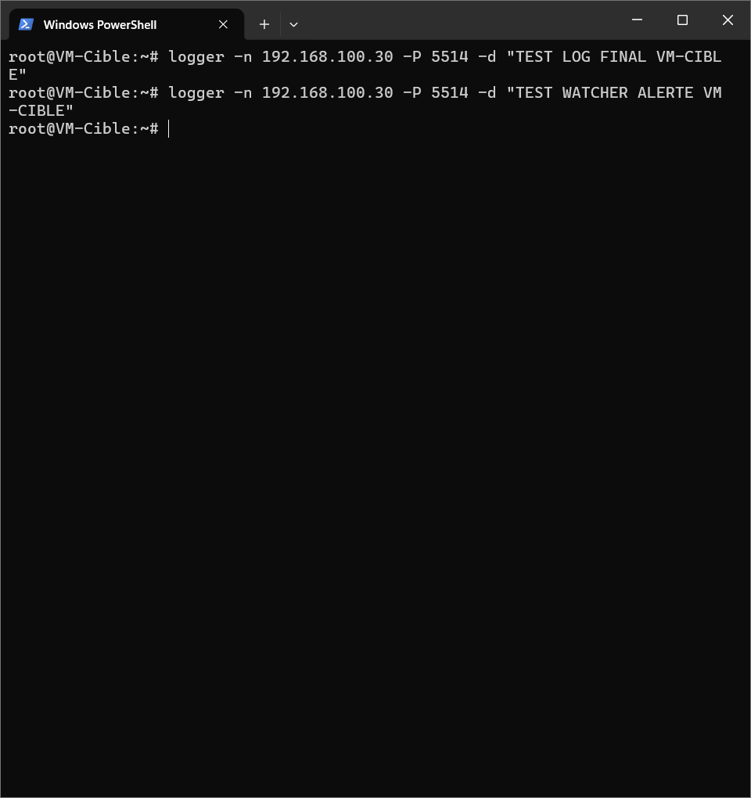

Exécution manuelle du watch :

```bash
curl -k -u 'elastic:TON_MDP' -X POST 'https://127.0.0.1:9200/_watcher/watch/enterprise-test-alert/_execute?pretty'
```

La sortie montre `"met": true`, `ctx.payload.hits.total = 1` et l'action `log_alert` exécutée.

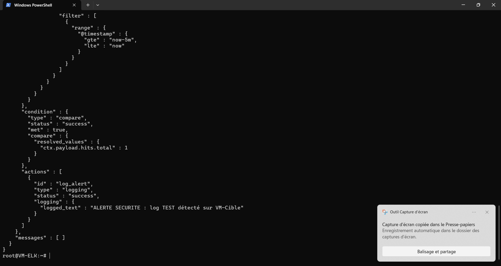

## 7. Bilan de la Mission 5

| Élément | État |
|---|---|
| Elasticsearch | ✅ |
| Logstash | ✅ |
| Kibana | ✅ |
| Import des logs | ✅ |
| Data View et visualisations | ✅ |
| Dashboard | ✅ |
| Watcher et test d'alerte | ✅ |

**Mission 5 — ELK, Logstash, Kibana et Watcher configurés et testés.**

---

# Mission 6 — Capture et analyse réseau avec Wireshark/TShark

## 1. Installation et contrôle de l'outil

TShark (Wireshark en ligne de commande) est installé et exécutable sur VM-ELK. La version affichée lors du contrôle est **4.4.18**.

```bash
tshark -v
```

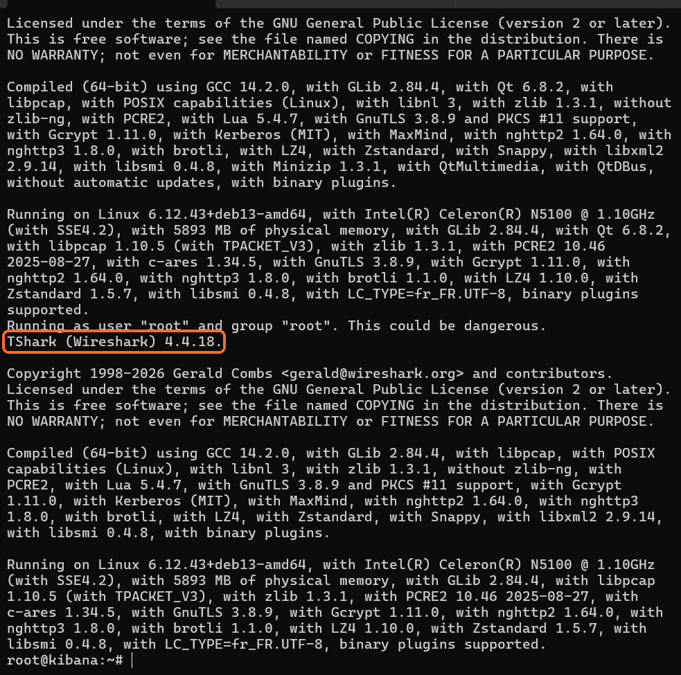

## 2. Capture du trafic Syslog

Le trafic UDP envoyé de VM-Cible vers Logstash a été capturé sur l'interface du réseau Host-Only avec le filtre `udp port 5514`.

```bash
tshark -i ens34 -f "udp port 5514" -w /tmp/mission06-syslog.pcapng
tshark -r /tmp/mission06-syslog.pcapng -Y "udp.port == 5514"
```

Échange observé :

- Source : `192.168.100.10`
- Destination : `192.168.100.30`
- Protocole : UDP
- Port de destination : `5514`

La même capture montre ensuite le démarrage de la capture Kibana sur `tcp port 5601`.

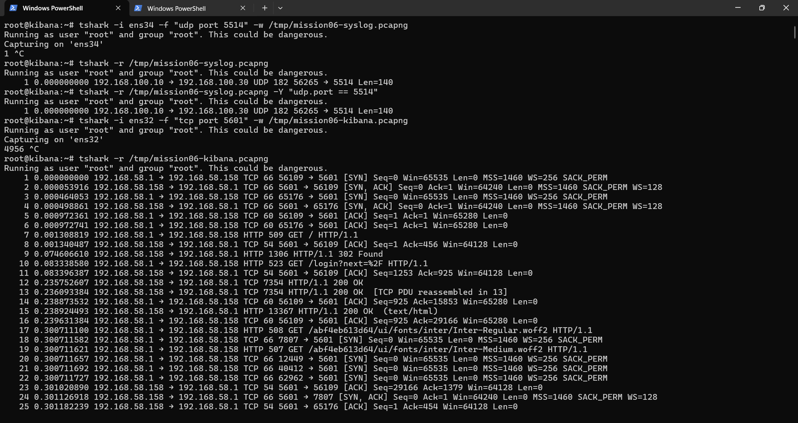

Les deux fichiers de capture produits :

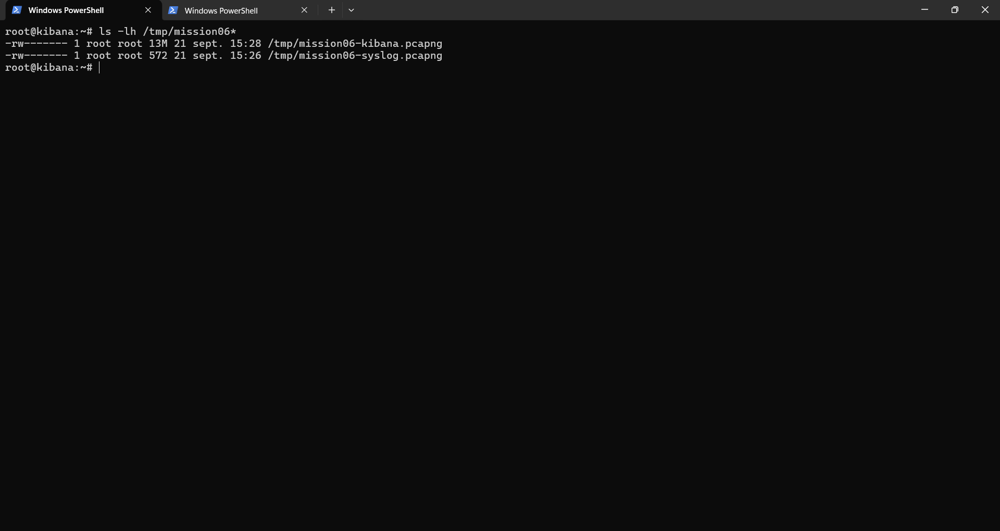

## 3. Capture du trafic Kibana

Le trafic vers Kibana a été capturé sur l'interface NAT avec le filtre `tcp port 5601`. Le fichier utilisé pour l'analyse est `/tmp/mission06-kibana.pcapng`.

Les requêtes HTTP du navigateur vers Kibana sont bien visibles (chargement des bundles, appels à l'API).

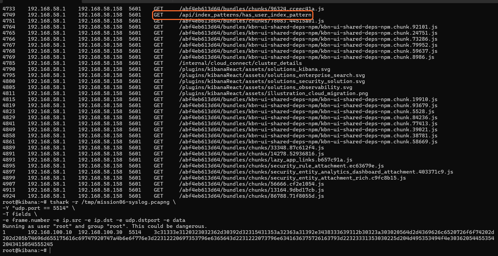

Les conversations TCP indiquent plusieurs connexions du client `192.168.58.1` vers le serveur Kibana `192.168.58.158:5601`. Ce trafic est cohérent avec les requêtes du navigateur lors du chargement de l'interface. Ces adresses sont celles du réseau NAT utilisé pendant cette capture.

```bash
tshark -r /tmp/mission06-kibana.pcapng -q -z conv,tcp
```

## 4. Codes HTTP relevés

Le filtre `http.response && http.response.code != 200` a relevé les réponses **302, 401, 202, 204, 500 et 503**.

```bash
tshark -r /tmp/mission06-kibana.pcapng \
  -Y 'http.response && http.response.code != 200' \
  -T fields -e frame.number -e ip.src -e ip.dst -e http.response.code
```

La capture ci-dessous montre la synthèse des conversations TCP puis la liste des codes non-200.

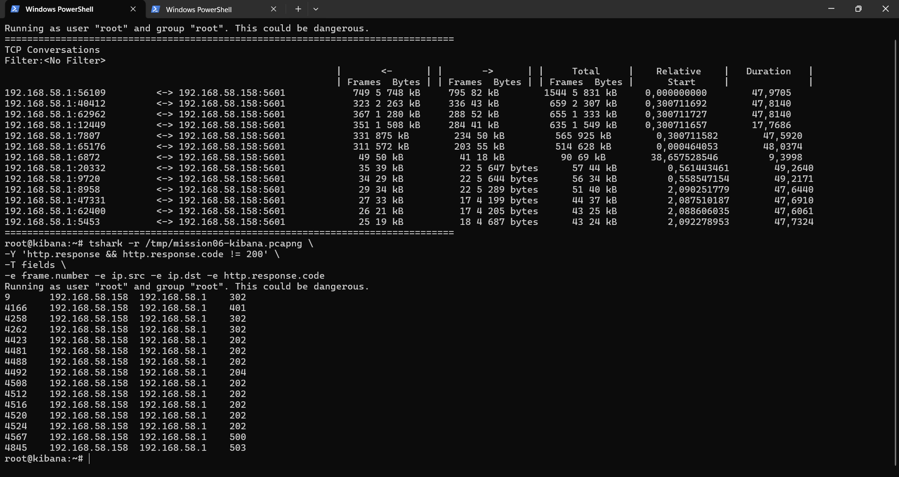

Interprétation :

- `302` : redirection, potentiellement normale lors de la navigation ou de l'authentification ;
- `401` : authentification requise ou refusée ;
- `202` et `204` : réponses HTTP valides pour certaines opérations ;
- `500` : erreur interne serveur ;
- `503` : service temporairement indisponible.

Les codes `500` et `503` justifient une investigation applicative, mais leur présence seule ne prouve pas une attaque. De même, un code `401` n'est pas nécessairement malveillant sans examiner la requête et son contexte.

## 5. Bilan de la Mission 6

| Activité | Résultat |
|---|---|
| Installation et exécution de TShark | Réalisé — version 4.4.18 |
| Capture Syslog UDP/5514 | Réalisée ; échange VM-Cible → VM-ELK observé |
| Capture du trafic Kibana/TCP 5601 | Réalisée sur l'interface NAT |
| Synthèse des conversations TCP | Réalisée |
| Relevé des codes HTTP non-200 | Réalisé |
| Investigation approfondie des erreurs et qualification de paquets suspects | À poursuivre : les codes seuls ne permettent pas de conclure à une attaque |

**Conclusion :** les captures et une première analyse des flux TCP/IP et HTTP ont été effectuées. Une conclusion de sécurité définitive nécessiterait de replacer les réponses atypiques dans le contexte des requêtes et des journaux applicatifs.

---

# Mission 7 — Tendance des connexions échouées

## 1. Recherche des événements

Dans Kibana Discover, la Data View `enterprise-logs` a été utilisée pour rechercher les messages contenant le terme `failed`, avec la requête KQL :

```kql
message: *failed*
```

La recherche a fait apparaître un événement syslog généré sur la VM-Cible : **`SECURITY TEST failed login for user admin from 192.168.100.10`**. Il s'agit d'un événement de test explicitement généré pour valider la recherche ; il ne constitue pas, à lui seul, la preuve d'une tentative malveillante réelle.

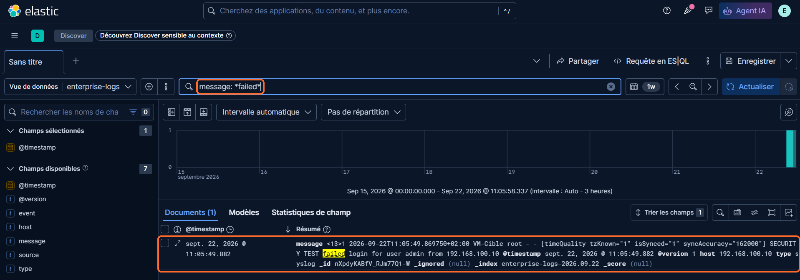

## 2. Visualisation temporelle

Une visualisation Lens de type **graphique en barres** a été configurée avec :

- **Axe horizontal :** `@timestamp` ;
- **Axe vertical :** nombre d'enregistrements ;
- **Filtre :** `message: *failed*` ;
- **Période affichée :** les 7 derniers jours.

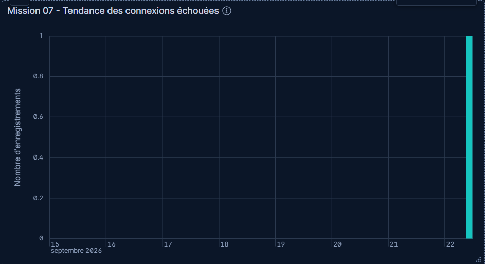

La visualisation a été enregistrée sous le titre **« Mission 07 - Tendance des connexions échouées »**, ajoutée à la bibliothèque et associée au **Dashboard Kibana 1**.

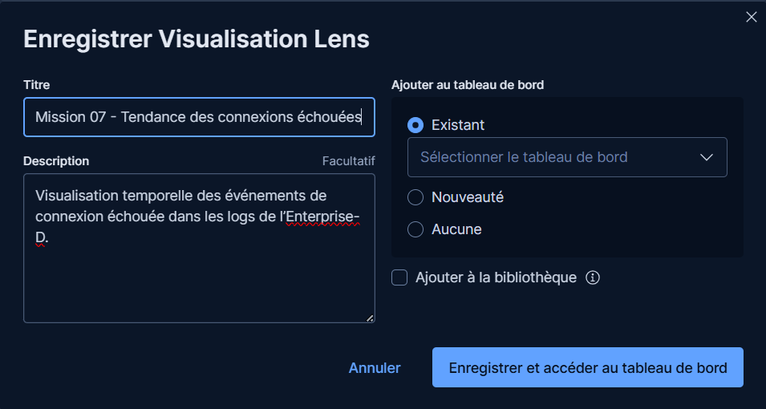

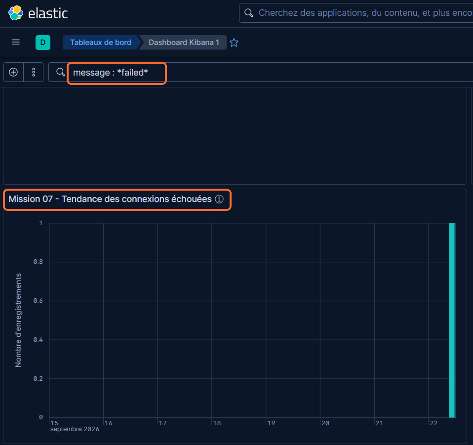

La visualisation a affiché une occurrence dans la période sélectionnée. Cela valide l'affichage de la donnée filtrée, mais une tendance statistique fiable nécessiterait un historique plus important et plusieurs événements répartis dans le temps.

## 3. Bilan de la Mission 7

| Élément | Résultat |
|---|---|
| Recherche des messages de connexion échouée dans Discover | Réalisée — événement de test retrouvé |
| Visualisation temporelle Lens | Créée — barres, `@timestamp` et nombre d'enregistrements |
| Enregistrement et ajout au dashboard | Réalisés — `Dashboard Kibana 1` |
| Analyse de tendance sur un volume conséquent | À approfondir : une occurrence observée |

**Conclusion :** la recherche d'un événement `failed` et la visualisation temporelle correspondante sont configurées. Le résultat observé est une preuve fonctionnelle de la chaîne de recherche et de visualisation, et non une conclusion qu'une attaque a eu lieu.

---

> Aucun mot de passe réel n'est présent dans ce dépôt. Les chaînes `TON_MDP` sont des placeholders à remplacer localement.
